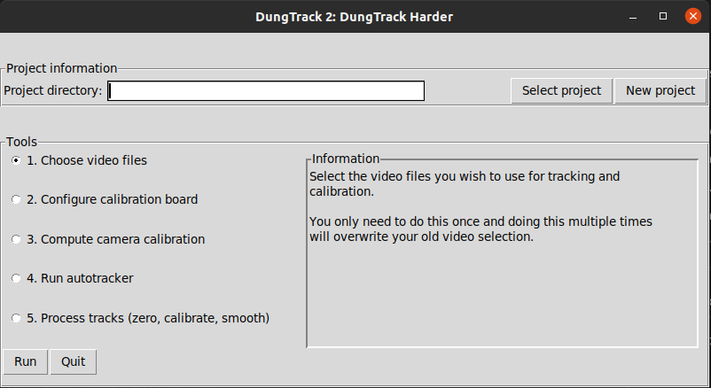
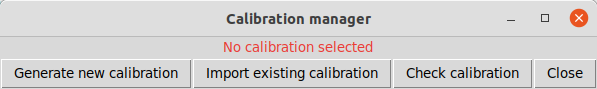
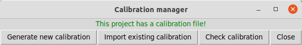
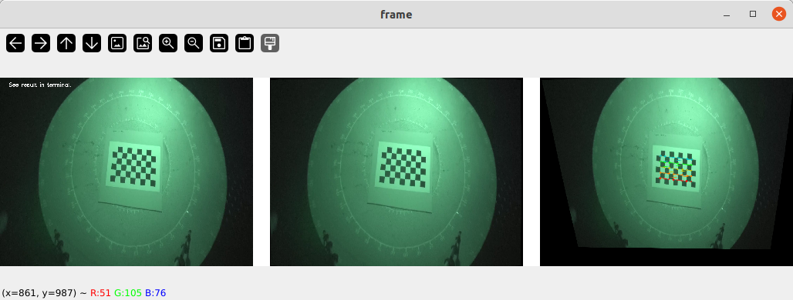
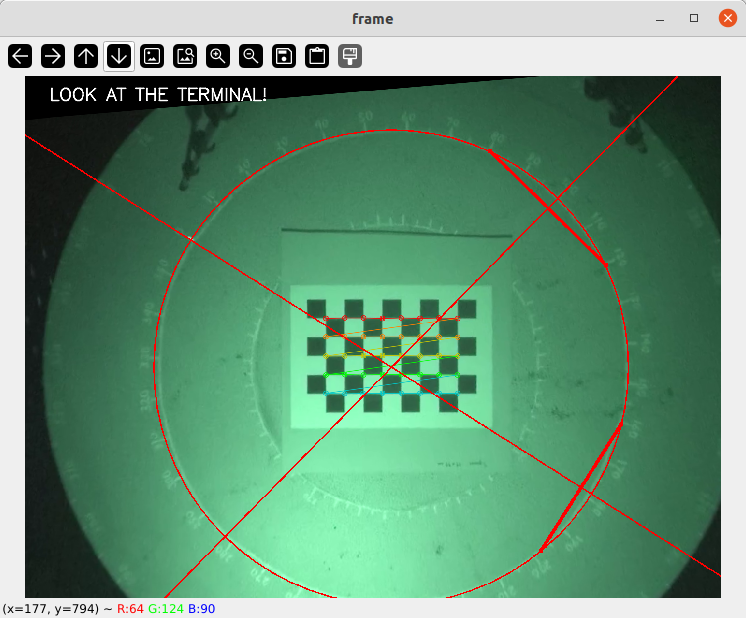
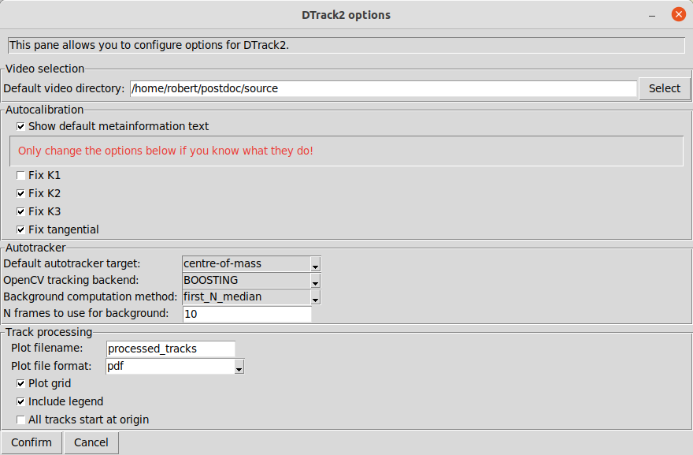

# Autotracker Deluxe

This repo is for the 'Autotracker deluxe' project wherein we are
trying to get a viable autotracking solution up and running for the
dung beetle group. 

## Installation
### Prerequisites

This software depends on Python 3 and pip3. You must have these
installed to run the software (and install dependencies). 

The prefix `$:` indicates a terminal command. You should enter everything after the colon.

#### Known compatibility problems

If you find any (suspected) compatibility problems, create a new GitHub issue. They will be added here as appropriate. 

- **MacOS 11 Big Sur**: The version of OpenCV which is installed by pip is built for MacOS 12 and will not run on Big Sur. You may be able to install a specific version which works but you'd need to modify `requirements.txt` yourself in order to make this work. The format for `requirements.txt` can be found [here](https://pip.pypa.io/en/stable/reference/requirements-file-format/). 

### Download

1. Click the 'Code' dropdown above.
2. Click 'Download ZIP'
3. Extract the Downloaded zip file and put the folder containing the code somewhere sensible.

You can also clone the repo using Git if you know how to do this.

### Opening a terminal in the right place

You can navigate to the code directory using the
command line if you know how to do this. Otherwise, you can open
a terminal via the graphical file explorer.

You will need to do this every time you want to use the software.

#### MacOS
Open Finder and find the code folder you just downloaded.
Hold control and click on the folder, then select
'Services' -> 'New Terminal at Folder'.

A terminal window should open.

#### Linux
Open your file explorer, find the code folder you just downloaded.
Right click and select 'Open in Terminal'.

**Note:** This may be distribution dependent.

### Installing dependencies

>**Linux**
>
>If working with Linux then make sure python3-venv and python3-tk are installed. On Ubuntu:
>
>`$: sudo apt install python3-venv python3-tk`
>
>These are included by default on MacOS and may be included by default in other linux distros.

The dependencies can be installed using a bash script. Make sure the terminal is open in the software directory, then run:

`$: ./SETUP`

This script will check for Python 3 and Pip installations, set up a virtual environment within the software directory, install the dependencies into the virtual environment, and create a launcher. If you open the file in a text editor you can see the source. 

>**Setup and launcher scripts**
>
>To ease usage, python, pip, and virtual environment management are wrapped in bash scripts. If you don't want to use these, then the dependencies can be installed with 
>
>`$: pip3 install -r requirements.txt`
>
>and the software can be run using:
>
>`$: python3 main.py`
>
>*If you're trying to use the setup script and it doesn't work, post an issue!*

---

## Usage instructions

Open the code folder in the terminal as you did during the installation process (either using the command line or the graphical file explorer).

### Startup and project selection
In the terminal, run: 
   
   `$: ./dtrack2` 
   
The main window should open:

Use the 'Select project' button to select an existing project, 'New project' if you wish to create a new project. In either case, a graphical selector will open to allow you to select the project *directory* (the folder in which all project related stuff will be stored).

**Note**: The directory selector is a little clunky, you need to be in the directory you want to select before confirming.

If you are creating a new project, or the project has never been opened with this version of the software, you will be asked if you want to create a project file. Click yes/ok.

Any tools you run will apply only to the currently active project.

Once a project directory is selected, it should be displayed in the project directory entry in the main window.

### Tools
Each stage can be engaged independently by selecting the appropriate radio button and clicking 'Run'.

#### 1. Choose video files
This tool will open a small video selector window.

Clicking 'Select' for calibration or tracking will open a file dialog to allow you to select the video. You can also copy the path into the entry but this is not recommended. 

The complete path to the video files is stored, so if the file location is not going to change, you can simply reference the files elsewhere on your hard drive. However, if the file location may change or you are working off of an external hard drive, you may want to make local copies. To do this, check the 'Copy video files locally?' option. This will make copies of the videos in the project directory.

Once you have selected your video files and determined whether you wish to make local copies, click 'Confirm'. Clicking 'Cancel' will discard all changes. 

**Note**: If you copied the files locally then the video filepaths stored by the software will point to the local copies. Thus, if you run the video selection tool again, the entries should show the local copy path rather than the one you originally selected.

**Important**: If you later update the video files for a given project and attempt to copy them locally, this will overwrite the video files in the project directory. The software will ask for confirmation before video files are deleted.

#### 2. Configure calibration board
This tool will open a calibration board selector window.

You can use the spinboxes at the top to select the dimensions of your calibration board. The window will update to show you a visualisation of the pattern. The OpenCV chessboard detection will be overlayed on the image so you can see what pattern the software is actually looking for during calibration.

>**How to choose your dimensions**
>
> The dimensions you chose should represent the largest *unobstructed* pattern in the video. 
>
> 
>
> In this case, the black tape border (and possibly the white cutout on the top right) will interfere with the chessboard detection algorithm. Therefore the largest unobstructed pattern here is 7 columns by 5 rows.
>
> Ideally, your calibration boards should have a thick white border around the edge.

Changing the square size will change the visible size of the board pattern but pixel size on screen does not matter, this is just for visual feedback. The square size will be used internally to estimate the homography between object coordinates and image coordinates. 

Once you have selected your rows, columns and square size, click 'Confirm'. Clicking 'Cancel' will discard any changes.

#### 3. Calibration manager
The calibration manager allows you to generate a calibration file from your calibration video, import a calibration file from a separate project, or visually inspect the results of your calibration on a candidate image.

**Generate new calibration**

This option will allow you to generate a calibration file from your calibration video using the Autocalibration tool. 

This tool will open your calibration video, select N random frames in which chessboards can be found, then store the images and the detected chessboard corners (in `project_directory/calibration_cache`). 

You need to provide:

1. The number of frames you wish to use
2. Some information describing the calibration
3. A video frame where the chessboard is on the ground (for extrinsic calibration)

The extrinsic claibration frame can be selected either from your calibration video (recommended) or from a file. To select a frame from your calibration video, use 'Select video frame', then use the trackbar to seek your frame in the video. Press 's' to save the frame; you should see the Extrinsic frame field update in the tool.

Once you've provided the necessary information, you can click 'Generate!'. This will create a directory called `calibration_cache` in your project directory which will contain the calibration file (`calibration.dt2c`), all of the images used for calibration (intrinsic and extrinsic) and all of the detected chessboard corners in image coordinates.

*Generating a new calibration will overwrite any previous calibration for the current project. This includes the image cache.*

**Import existing calibration**
If you already have a calibration which is working well, you can import this. This button will open a file dialog which will allow you to select the calibration file you want to import. 

Calibration files are stored in `your_project_directory/calibration_cache/calibration.dt2c`. Find the calibration file you want and click 'Open' in the file dialog. 

*You can copy these by hand but you need to make sure they're in the right place with the right name. Just use the import tool.*

**Check calibration**

This option will allow you to visually inspect your calibration to determine how good it is. Additional quality information and some instructions are shown in the terminal. 

This is your undistorted and perspective transformed video frame. Click on four points in the image which lie on the arena radius. The points will be marked when you click on them. When you finish providing the points some lines and a circle will appear over your image.

*What's happening here?*

The four points will define two lines (thicker red lines above) which are interpreted as chords of the arena circle. Perpendicular bisectors are then drawn which should intersect at the centre of your arena. A perfect circle is then drawn assuming that the point of intersection is the arena centre (the radius is given by the distance from the point of intersection to the first point you clicked).

The red circle should overlap almost perfectly with your arena. There will be some error because calibration is imperfect and your clicks may be imperfect.

More information is given in the terminal. In particular, the software will estimate the (known) length of the top edge of the chessboard in millimetres. In addition, the software will estimate your arena radius by computing the average distance from the estimated centre of the arena to the radial points you clicked.

*Why is there a blue border?*

When the perspective transformation is applied, the image will be warped such that it is no longer rectangular. There are therefore pixels in the rectangular frame which do not belong to the image. These are filled in solid blue so that it's easy to see where the image pixels are.

*What if I misclick?*
For now, simply close the window and select 'Check calibration' again. 

#### 4. Autotracker
1. A new window will open playing the video to be tracked (at high speed)
2. Let the video play or skip to a point you wish to start tracking
3. Press P to pause the video, then T to start a track.
4. Select a rectangle (region of interest, ROI) which contains the beetle (be generous). The selection starts from the centre of the region so click and drag from the beetle. Press Enter and close the window. 
5. Press P to play. The bounding box will be overlayed on the video and should track the beetle. The point which is tracked is the centre of the bounding box which is also drawn.
6. Press T to finish the current track.
7. Goto (2)

You can produce any number of tracks from the video. The tracks will be appended
to the track file (`<project_directory>/raw_tracks.csv`). 

**Notes**
1. If you want to cancel your ROI selection, press C then close the window.
2. If you press T by mistake and don't want to track, press T again to cancel. If you didn't play the video while tracking was enabled, the track file won't be modified.
3. You cannot use Q to quit while the video is paused. You can just close the window.
4. Do not use the trackbar while tracking. This will probably break things.
5. The coordinates produced are the centre of mass of the 'blob' which contains
   the beetle and its ball on a given frame. 

#### 5. Process tracks
This option runs in full when you click 'Run'. At present this will:
1. Calibrate the tracks (undistort, transform perspective, and scale to mm)
2. Smooth the tracks using a basic univariate spline
3. Produce and display a plot showing the smoothed tracks.
4. Compute some basic summary statistics for your tracks.

If enabled in the options (see below) this tool will also zero all of your tracks so that they start at (0,0).

The calibration, zeroing, and smoothing stages all produce CSV files with the results. You 
can take these and open them in Excel or LibreOffice (or your preferred analysis
environment) and do whatever analysis/plotting you want. These files are
in the project directory, named `calibrated_tracks.csv`, `zeroed_tracks.csv`, and `smoothed_tracks.csv` 
respectively (there is also a file for raw tracks `raw_tracks.csv`)

The software will also show a plot and a copy is stored in your project directory (by default this is called `processed_tracks.pdf`). This plot is here so you can visually inspect what the autotracker has done and see if there are any obvious problems before you work on the data. *This is not intended to be a publication-quality plot as I assume you'll have your own elements you want to emphasise!* You can configure the software to output an eps or svg file (see below) which can be imported in Inkscape or Adobe Illustrator so you can use the plot as a basis for your own nicer plots. 

Basic summary statistics for each track (and averages over all tracks) will be shown in the terminal. These are stored in your project directory in `summary_statistics.csv`. Again, you can open these in Excel or LibreOffice or whatever analysis tool you prefer.

**Note on time-dependent statistics:** Statistics which depend on time are computed by using the timestamp associated with each tracked frame. This should work regardless of whether you track every frame or every *n*th frame. I do not know if these timestamps account for variable framerates.

---

## Configuration

Clicking the 'Options' button at the bottom right-hand side of the main window will display a window with some software options.

Options are broken down by the tool to which they relate. The available options are discussed below and more are on the way (if you have suggestions, please post an issue as a feature request). **These options will persist across different projects!**

Once you have changed any options you must click 'Confirm' to actually save them. These options are stored in the params file (`params.json`). 

---

### Video selection
#### Default video directory
Here you can set the default directory in which the software will look for videos when using the video selection tool. This may be useful if you keep all of your videos stored in the same place on your hard drive. The default option '.' is shorthand for 'the current working directory' which will be the directory from which you are running the software. You can either type directly in the box or click 'Select' to get a file dialog. 

---

### Autocalibration
#### Show default metainformation text
By default, the metainformation box in the autocalibration tool displays some instructive text. This can be annoying to delete once you know what to do, so set this if you want the text box to appear blank.

#### Distortion coefficient settings
The remaining settings relate to the camera model used during calibration. You should not need to modify these but it may be useful to do so for testing. The default camera model assumes more variability than there should actually be for the cameras we use.
Therefore some (most) of the distortion parameters are fixed (disabled) by default. Including them in calibration tends to cause more harm than good. By default, only
*k1* is included in camera calibration. If you 'fix' (disable) all four parameters
then the camera model will assume that no lens distortion is added to your images 
(which probably isn't true). Your resultant tracks will then also be distorted.

Just *k1* is probably good enough. At most you may have to free (enable) *k2*.

##### Fix K1
Fixes radial distortion parameter *k1* to a constant value. 

##### Fix K2
Fixes radial distortion parameter *k2* to a constant value.

##### Fix K3
Fixes radial distortion parameter *k3* to a constant value.

##### Fix tangential
Autocalibration will assume zero tangential distortion. (If this is not true then set this camera aside for electrophysiology experiments.)

---

### Autotracker
#### Default autotracker target
This determines the actual point which is tracked when you run the autotracker. The *centre-of-mass* option tracks the centre of mass of a segmented beetle (within the bounding box you define when running the autotracker). The *centre-of-bounding-box* option tracks the centre of the bounding box which assumes the beetle remains centred in the bounding box (which probably isn't true).

*If the centre-of-mass is more accurate, why use the bounding box?*

The segmentation used to extract the centre of mass can fail for very dark videos where there is poor contrast between the beetle and its background. The OpenCV trackers seem to be more robust so will continue to function even if the segmentation fails. In these cases, you can track the centre of the bounding box and still get a track where the segmentation is failing. Basically, **use centre-of-mass unless you're having problems, then switch to centre-of-bounding-box**.

**Important:** There is no record of which method you used and you could (in theory) change the track point between different rolls of the same beetle. If you do this, make a note of it (assuming it matters to you).

#### OpenCV Tracking backend
The actual tracking component is handled by OpenCV. OpenCV has a number of built-in object trackers which may work better in different scenarios. Given the relative simplicity of the visual task, I'm not sure how much modifying the tracker will help. You may be able to speed up your tracking though.

Some information on the different options can be found [here](https://broutonlab.com/blog/opencv-object-tracking/).

#### Background computation method
This option only applies if the autotracker target is set to *centre-of-mass*. 

This determines how a background frame is synthesised. The 'first_N_median' option will take the median of the first N frames of your video, 'first_N_mean' will take the mean of the first N frames of your video, and 'random_N_mean' will take a random sample of N frames from your video and take the mean. 

The first_N_* options tend to work well enough, but they can struggle if the lighting changes significantly after the start of your video. In these cases you may want to use 'random_N_mean' but this method is slower and will take longer with greater N. The speed penalty is only incurred when you start the autotracker as the background is pre-computed.

#### N frames to use for background
This option only applies if the autotracker target is set to *centre-of-mass*. 

This is simply the number of frames (N) to be used by the background computation algorithm. E.g. if you set the background computation method to 'first_N_median', then this option 10, then your background will be the median frame of the first 10 frames of your video.

#### Tracking interval
This determines the interval on which the tracking video will be played back. For example, if the tracking interval is 1, then the system will play every frame. If the interval is 4, then the system will play every 4th frame. 

Increasing the tracking interval decreases the resolution of your track but this is not necessarily a problem. Tracking on every frame is noisy anyway and tracking every *n*th frame greatly speeds up the tracking process. 

If you increase the tracking interval too much, then the tracker might fail (if the beetle has moved too far after the *n* frame jump).

Track timing information is computed using millisecond timestamps on each frame of the video so changing this option should have no (or negligible, allowing for error) effect on the computed time for a track.

>**Note** 
>
> This option may not work well if you are tracking the centre of the bounding box as opposed to computing the centre of mass.

#### Remember ROI
By default, the tracker requires you to specify the region of interest (a bounding box in which the beetle sits) for every track. If you select this option then the autotracker will remember the first bounding box you select and assume it is valid for subsequent tracks.

In brief, this means that the software assumes all of your beetles start rolling from the same place.

If this option is enabled then you can press 'r' when the video is paused in order to re-define your bounding box if needs be. 

#### Show ROI window
If enabled, the autotracker will show a small window with the binarised image of the contents of the bounding box. This can be useful for diagnostic purposes (e.g. if it looks like the tracker is struggling with your video).

In the binarised image, the 'blob' of the beetle and its ball should be clearly visible in white. If not, then the contrast may be too low for background subtraction to work consistently. If this is the case, you may want to switch to tracking the centre of the bounding box as opposed to the  centre of mass.

---

### Track Processing
#### Plot filename
Track processing will automatically produce a plot which is saved to a file in the project directory. You can specify the name of that file here. 

#### Plot file format
Different file formats offer different advantages. Here you can choose from pdf, eps, svg, or png (at 400dpi).

#### Plot grid
When enabled, this option will include a grid on your plot which makes it easier to read off the x and y axes at different positions. This can be disabled if you just want the tracks.

#### Include legend
When enabled, this option will include a legend which tells you which colour is assigned to which track index. 

**Note:** Matplotlib will cycle through ten unique colours before it starts to repeat. 
If you have more than ten tracks for a given beetle then this means that some tracks
will be plotted in the same colour. 

#### All tracks start at origin
This option will shift all tracks so that they start at (0,0). This can be useful if you want to quickly look at how the tracks are distributed but removes some information (e.g. placement variability with respect to the true arena centre). 

*You shouldn't use this option unless you know all of your tracks start at the arena centre and end at the arena's edge.*

#### Smoothing spline degree
The calibrated tracks are smoothed using a [UniveriateSpline](https://docs.scipy.org/doc/scipy/reference/generated/scipy.interpolate.UnivariateSpline.html) from scipy. Changing this parameter allows you to change the degree (*k*) of the smoothing function.

Practically this can affect how 'smooth' your tracks appear but the main way to adjust that is to use the smoothing scale factor (see next entry).

#### Smoothing scale factor
When smoothing, there is a parameter *s* which controls the trade-off between the smoothness and accuracy of the output track (go [here for more information](https://docs.scipy.org/doc/scipy/tutorial/interpolate/smoothing_splines.html)). This parameter is largely found by trial and error and good values depend on the statistics of the track. The software assumes all points in the track should get equal weight in the smoothing process (all points are equally meaningful), so we guess that

`s = scale * (m * std)`

where *scale* is a scaling factor, *m* is the length of the track and *std* is the standard deviation of the data (*s* is computed separately for x and y coordinates).

You can change *scale* to be between 0 and 1; it's up to you to choose a value which makes sense.

>**Note:** This parameter is very sensitive. 
>
>`scale == 0`
>
>
>
>`scale == 0.3`
>

## Miscellany
### Interlaced video
Some videos are stored in an interlaced format. In the software, this appears as a 'combing' or 'tearing' effect:

This is particularly problematic for calibration. If you have the option, turn this off in your camera. If you are working with pre-existing videos, you can deinterlace them by using ffmpeg.

`$ ffmpeg -i input.file -vf yadif output.file`

Replace `input.file` and `output.file` with the name of your input and output files and 'file' with the file extension.

You will probably need to install ffmpeg separately. You can use any other tool you know of which can produce a deinterlaced video file.

Running the command above on a non-interlaced file doesn't seem to cause any problems.

### Params file
When you run the software it should create a file called 'params.json' in the software directory. Do not modify this file by hand. It stores the path of the current project and path to the project file which are relied on internally.

### Project files
Inside your project directories, a project file will be created (*.dt2p). This will store all of the information about the project (which video files to use, calibration board configuration, etc.). Again, do not modify this by hand.
